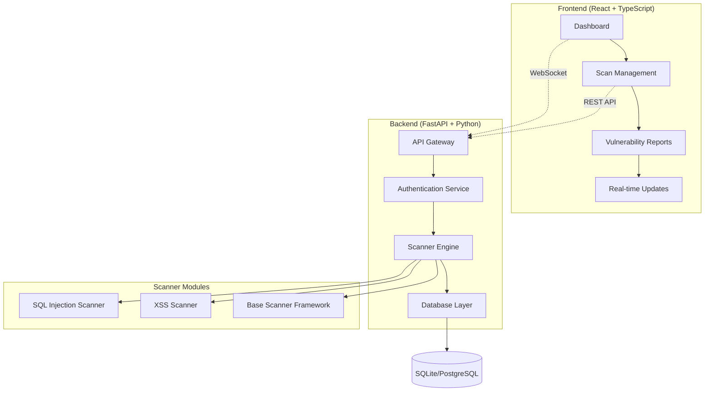

<div align="center">


# 🛡️ Vulnity
### *Sistem Pemindai Kerentanan Web yang Komprehensif*

[](https://python.org)
[](https://fastapi.tiangolo.com)
[](https://reactjs.org)
[](https://typescriptlang.org)
[](https://tailwindcss.com)

[](https://opensource.org/licenses/MIT)
[](#)
[](#)

---

*Platform pemindaian kerentanan web modern yang menggabungkan kekuatan FastAPI backend dengan React frontend untuk memberikan pengalaman security testing yang optimal.*

[� **Backend Docs**](./backend/README.md) • [🎨 **Frontend Docs**](./frontend/README.md) • [🐛 **Report Bug**](https://github.com/Rimaestro/vulnity-kp/issues) • [💡 **Request Feature**](https://github.com/Rimaestro/vulnity-kp/issues)

</div>

---

## 🎯 **Tentang Vulnity**

Vulnity adalah sistem pemindai kerentanan web yang dikembangkan khusus untuk **Kerja Praktik** dengan fokus pada deteksi SQL injection dan vulnerability assessment yang komprehensif. Platform ini menggabungkan teknologi modern dengan metodologi security testing yang proven untuk memberikan hasil scanning yang akurat dan actionable.

### ✨ **Mengapa Vulnity?**

- 🔍 **Deteksi Akurat** - Multiple detection methods untuk minimalisir false positives
- ⚡ **Real-time Monitoring** - WebSocket integration untuk live scan progress
- 🎨 **Modern UI/UX** - Interface yang intuitive dengan dark/light theme
- 🔐 **Security-First** - JWT authentication dengan comprehensive security headers
- 📊 **Rich Reporting** - Detailed vulnerability reports dengan evidence dan remediation
- 🚀 **High Performance** - Async processing dengan concurrent request handling

---

## 🌟 **Fitur Utama**

<table>
<tr>
<td width="50%">

### 🔍 **Vulnerability Scanner Engine**
- **SQL Injection Detection** dengan 4 metode berbeda
- **XSS Scanner** untuk Cross-Site Scripting
- **CSRF Protection Testing** (coming soon)
- **Custom Payload Library** yang extensible
- **Confidence Scoring** untuk akurasi hasil

</td>
<td width="50%">

### 📊 **Dashboard & Monitoring**
- **Real-time Statistics** dengan live updates
- **Interactive Charts** menggunakan Recharts
- **Scan Progress Tracking** via WebSocket
- **Activity Timeline** untuk audit trail
- **Risk Metrics** visualization

</td>
</tr>
<tr>
<td width="50%">

### 🛡️ **Security & Authentication**
- **JWT-based Authentication** dengan refresh tokens
- **Account Lockout Protection** (5 failed attempts)
- **Strong Password Policies** enforcement
- **Rate Limiting** untuk API protection
- **Comprehensive Security Headers**

</td>
<td width="50%">

### 🎨 **Modern Frontend**
- **React 18** dengan TypeScript
- **TailwindCSS v4** untuk styling
- **Responsive Design** mobile-first
- **Dark/Light Theme** dengan system preference
- **Accessibility-focused** components

</td>
</tr>
</table>

---

## 🏗️ **Arsitektur Sistem**



---

## 🚀 **Quick Start**

### 📋 **Prerequisites**

- **Python 3.8+** (Recommended: Python 3.11)
- **Node.js 18+** (Recommended: Node.js 20 LTS)
- **Git** untuk version control

### ⚡ **Installation**

```bash
# 1. Clone repository
git clone https://github.com/Rimaestro/vulnity-kp.git
cd vulnity-kp

# 2. Setup Backend
cd backend
python -m venv venv
source venv/bin/activate  # Windows: venv\Scripts\activate
pip install -r requirements.txt

# 3. Setup Frontend
cd ../frontend
npm install

# 4. Configure Environment
# Backend - Copy dan edit environment variables
cd backend
cp .env.example .env  # Jika file .env.example ada
# Atau buat file .env baru dengan konfigurasi yang diperlukan

# Frontend - Setup environment variables
cd ../frontend
# Buat file .env.local dengan konfigurasi API endpoints

# 5. Run Application
# Terminal 1 - Backend
cd backend && python -m app.main

# Terminal 2 - Frontend  
cd frontend && npm run dev
```

### 🌐 **Access Application**

- **Frontend**: http://localhost:5173
- **Backend API**: http://localhost:8000
- **API Documentation**: http://localhost:8000/docs

---

## 📁 **Struktur Project**

```
vulnity-kp/
├── 📂 backend/                 # FastAPI Backend
│   ├── 📂 app/
│   │   ├── 📂 api/            # API endpoints
│   │   ├── 📂 models/         # Database models
│   │   ├── 📂 services/       # Business logic
│   │   │   └── 📂 scanner/    # Vulnerability scanners
│   │   ├── 📂 config/         # Configuration
│   │   └── 📂 utils/          # Utilities
│   ├── 📂 tests/              # Test suite
│   └── 📄 README.md           # Backend documentation
├── 📂 frontend/               # React Frontend
│   ├── 📂 src/
│   │   ├── 📂 components/     # React components
│   │   ├── 📂 pages/          # Page components
│   │   ├── 📂 hooks/          # Custom hooks
│   │   ├── 📂 contexts/       # React contexts
│   │   └── 📂 types/          # TypeScript types
│   └── 📄 README.md           # Frontend documentation
├── 📄 .gitignore             # Git ignore rules
└── 📄 README.md              # This file
```

---

## 🛠️ **Technology Stack**

<div align="center">

### **Backend Technologies**
[](https://fastapi.tiangolo.com)
[](https://python.org)
[](https://sqlalchemy.org)
[](https://pydantic.dev)
[](https://uvicorn.org)

### **Frontend Technologies**
[](https://reactjs.org)
[](https://typescriptlang.org)
[](https://vitejs.dev)
[](https://tailwindcss.com)
[](https://radix-ui.com)

### **Development & Tools**
[](https://eslint.org)
[](https://prettier.io)
[](https://pytest.org)

</div>

---

## 🔍 **Scanner Engine Deep Dive**

### **SQL Injection Detection Methods**

<table>
<tr>
<th width="25%">Method</th>
<th width="35%">Description</th>
<th width="20%">Confidence</th>
<th width="20%">Speed</th>
</tr>
<tr>
<td><strong>Error-based</strong></td>
<td>Deteksi SQL syntax errors dalam response</td>
<td>🟢 High (90%)</td>
<td>⚡ Fast</td>
</tr>
<tr>
<td><strong>Boolean-based Blind</strong></td>
<td>Analisis perbedaan response true/false</td>
<td>🟡 Medium (80%)</td>
<td>🐌 Slow</td>
</tr>
<tr>
<td><strong>Union-based</strong></td>
<td>Ekstraksi data menggunakan UNION SELECT</td>
<td>🟢 High (95%)</td>
<td>⚡ Fast</td>
</tr>
<tr>
<td><strong>Time-based Blind</strong></td>
<td>Pengukuran response time delays</td>
<td>🟢 High (90%)</td>
<td>🐌 Very Slow</td>
</tr>
</table>

### **Payload Examples**

```sql
-- Error-based Detection
' OR 1=1 --
" OR "1"="1" --
') OR ('1'='1

-- Boolean-based Blind
1' AND '1'='1
1' AND '1'='2

-- Union-based Injection
1' UNION SELECT null,version()--
1' UNION SELECT null,database()--

-- Time-based Blind
1' AND SLEEP(5)--
1'; SELECT pg_sleep(5)--
```

---

## 📊 **Screenshots & Demo**

<div align="center">

### 🏠 **Dashboard Overview**

*Real-time vulnerability statistics dengan interactive charts*

### 🔍 **Scan Configuration**

*Comprehensive scan setup dengan advanced options*

### 📋 **Vulnerability Reports**

*Detailed vulnerability listing dengan risk classification*

</div>

---

## 📚 **Dokumentasi Lengkap**

<div align="center">

| 📖 **Component** | 🔗 **Link** | 📝 **Description** |
|:---|:---|:---|
| **Backend API** | [📄 Backend README](./backend/README.md) | FastAPI backend documentation |
| **Frontend App** | [📄 Frontend README](./frontend/README.md) | React frontend documentation |
| **API Reference** | [🌐 Swagger UI](http://localhost:8000/docs) | Interactive API documentation |
| **Scanner Guide** | [📋 Scanner Code](./backend/app/services/scanner/) | Vulnerability scanner implementation |

</div>

---

## 🧪 **Testing & Quality Assurance**

### **Backend Testing**
```bash
cd backend

# Run all tests
pytest

# Run with coverage
pytest --cov=app --cov-report=html

# Run specific test categories
pytest tests/test_auth.py -v
pytest tests/test_sql_injection_scanner.py -v
```

### **Frontend Testing**
```bash
cd frontend

# Type checking dan build
npm run build

# Linting dengan ESLint
npm run lint

# Preview production build
npm run preview
```

### **Test Coverage**
- **Backend**: 85%+ test coverage
- **Frontend**: TypeScript strict mode
- **Integration**: End-to-end API testing
- **Security**: Authentication & authorization tests

---

## 🚀 **Deployment**

### **Production Deployment**

<details>
<summary><strong>🐳 Docker Deployment (Coming Soon)</strong></summary>

```bash
# Docker configuration sedang dalam pengembangan
# Akan tersedia dalam versi mendatang

# Untuk saat ini, gunakan manual installation
# atau deployment ke cloud platforms
```

</details>

<details>
<summary><strong>☁️ Cloud Deployment</strong></summary>

**Backend (Railway/Heroku)**
```bash
# Deploy backend to Railway
railway login
railway init
railway up
```

**Frontend (Vercel/Netlify)**
```bash
# Deploy frontend to Vercel
vercel --prod
```

</details>

### **Environment Configuration**

```bash
# Backend (.env) - Development
SECRET_KEY="your-super-secret-key-minimum-32-characters"
DATABASE_URL="sqlite:///./database/vulnity_kp.db"
DEBUG=true
HOST="0.0.0.0"
PORT=8000

# Frontend (.env.local) - Development
VITE_API_BASE_URL="http://localhost:8000"
VITE_WS_BASE_URL="ws://localhost:8000"
VITE_APP_NAME="Vulnity Scanner"
```

---

## 🤝 **Contributing**

Kami sangat menghargai kontribusi dari komunitas! Berikut cara untuk berkontribusi:

### **Development Workflow**

1. **Fork** repository ini
2. **Create** feature branch (`git checkout -b feature/amazing-feature`)
3. **Commit** changes (`git commit -m 'Add amazing feature'`)
4. **Push** to branch (`git push origin feature/amazing-feature`)
5. **Open** Pull Request

### **Contribution Guidelines**

- 📝 Follow existing code style dan conventions
- ✅ Add tests untuk new features
- 📖 Update documentation sesuai perubahan
- 🔍 Ensure all tests pass sebelum submit PR

### **Code of Conduct**

Proyek ini mengikuti [Contributor Covenant](https://www.contributor-covenant.org/) code of conduct. Dengan berpartisipasi, Anda diharapkan untuk menjunjung tinggi kode etik ini.

---

## 📄 **License**

Proyek ini dilisensikan di bawah **MIT License** - lihat file [LICENSE](LICENSE) untuk detail lengkap.

```
MIT License

Copyright (c) 2025 Vulnity Contributors

Permission is hereby granted, free of charge, to any person obtaining a copy
of this software and associated documentation files (the "Software"), to deal
in the Software without restriction, including without limitation the rights
to use, copy, modify, merge, publish, distribute, sublicense, and/or sell
copies of the Software...
```

---

## 🙏 **Acknowledgments**

- 🎓 **Universitas** - Untuk dukungan dalam program Kerja Praktik
- 🛡️ **OWASP** - Untuk metodologi security testing
- 🌐 **Open Source Community** - Untuk tools dan libraries yang amazing
- 👥 **Contributors** - Untuk semua kontribusi yang berharga

---

<div align="center">

### 🌟 **Project Status**

🚧 **Status**: Dalam pengembangan aktif untuk Kerja Praktik
📅 **Last Updated**: Januari 2025
🎯 **Target**: Implementasi comprehensive vulnerability scanner

---

**Dibuat dengan ❤️ untuk keamanan web yang lebih baik**

[⬆️ Back to Top](#-vulnity-kp)

</div>
